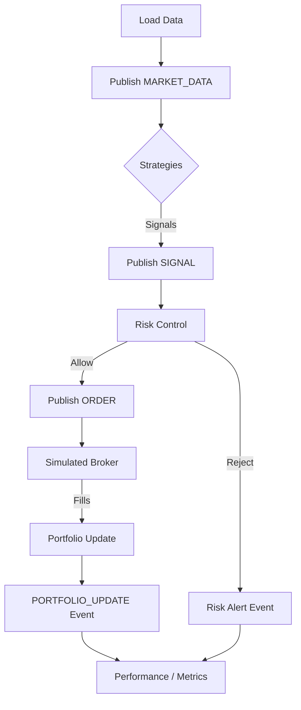

## Backtest Engine Workflow

The backtest engine executes a deterministic loop for every bar in the loaded price
series. Each iteration is composed of the following ordered stages:

1. **Data fetch** – the `DataRetrieval` layer (or previously loaded frame) provides a
   normalized OHLCV slice for the active symbol set.
2. **Market data event** – the engine publishes a `MARKET_DATA` event on the event bus.
3. **Strategy signal** – every registered strategy consumes the market data and emits
   `SIGNAL` events via the orchestrator.
4. **Risk evaluation** – the `RiskControlManager` inspects current exposure before any
   orders are sent; high-risk states short–circuit order submission and emit alerts.
5. **Order placement** – signals are transformed into normalized orders, published as
   `ORDER` events, and forwarded to the `SimulatedBroker`.
6. **Broker fill** – the broker applies commissions/slippage, updates cash/positions, and
   publishes execution `ORDER` events.
7. **Portfolio update** – `GeneralPortfolio` ingests the fills, recomputes valuations, and
   emits a `PORTFOLIO_UPDATE` event.
8. **Performance logging** – the engine records the tick’s portfolio value, trade history,
   and any risk alerts to feed downstream analytics.

### Lifecycle Diagram

### Lifecycle Hooks

The engine now invokes the following optional hooks on `BaseSignalStrategy`,
`GeneralPortfolio`, and `SimulatedBroker`:

- `before_run(metadata)` / `after_run(metadata)` – fired once before/after the simulation.
- `before_tick(context)` / `after_tick(context, results)` – fired on every bar.

Strategies or custom components can override these hooks to pre-compute indicators,
warm caches, or emit additional instrumentation without modifying the engine loop.
